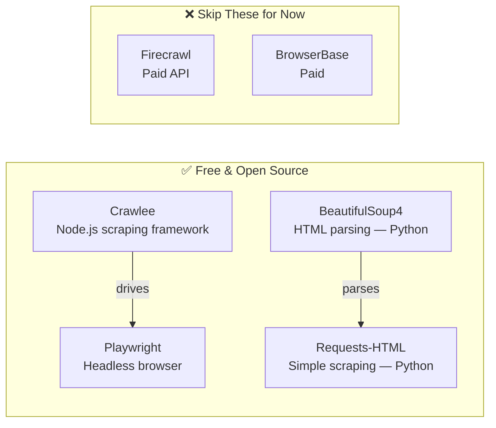
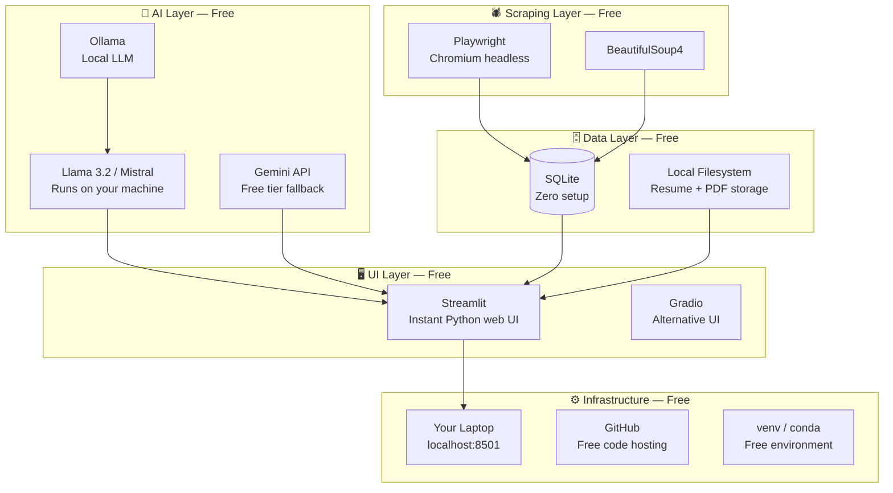
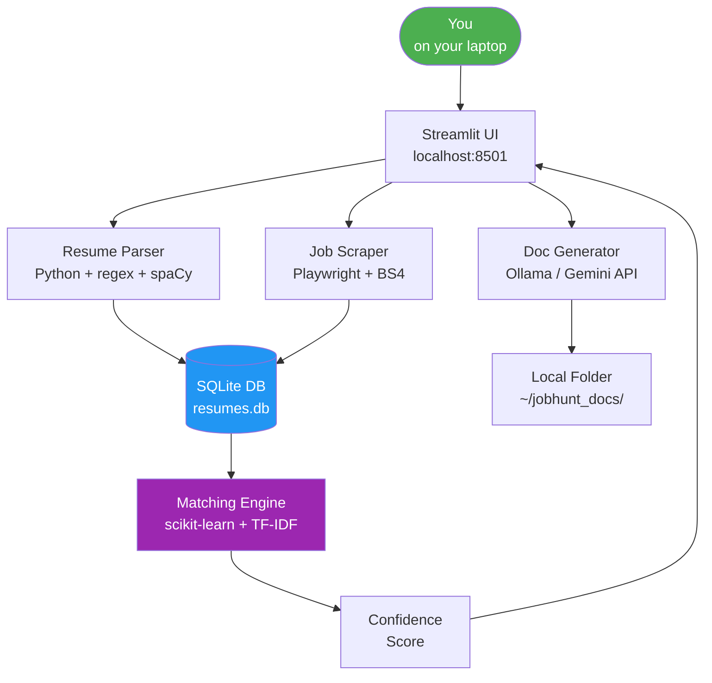
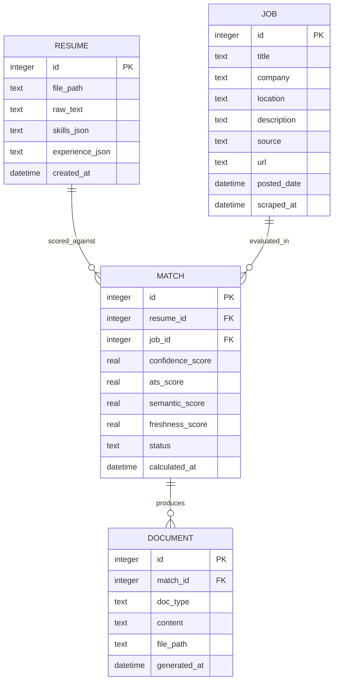
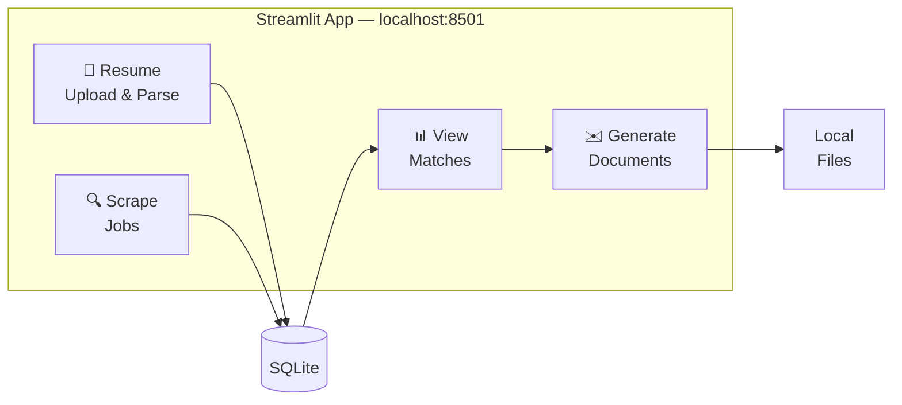
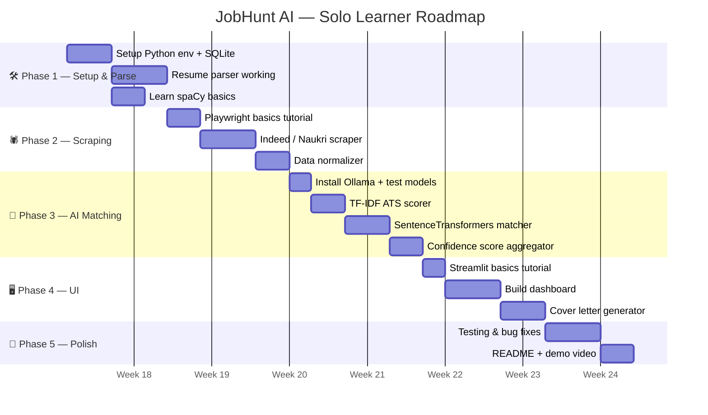
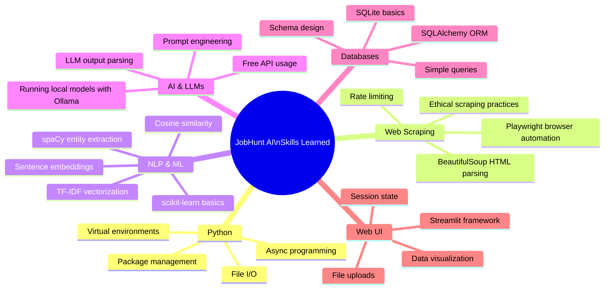
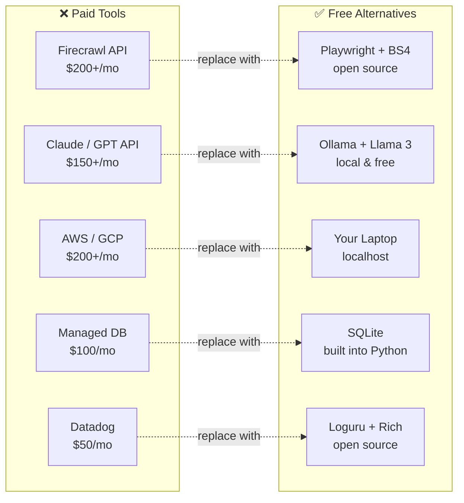
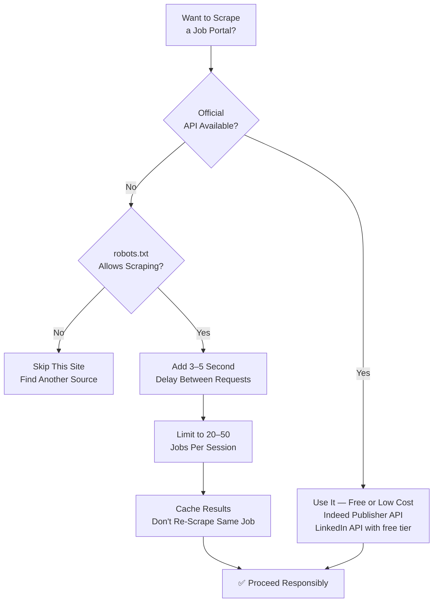
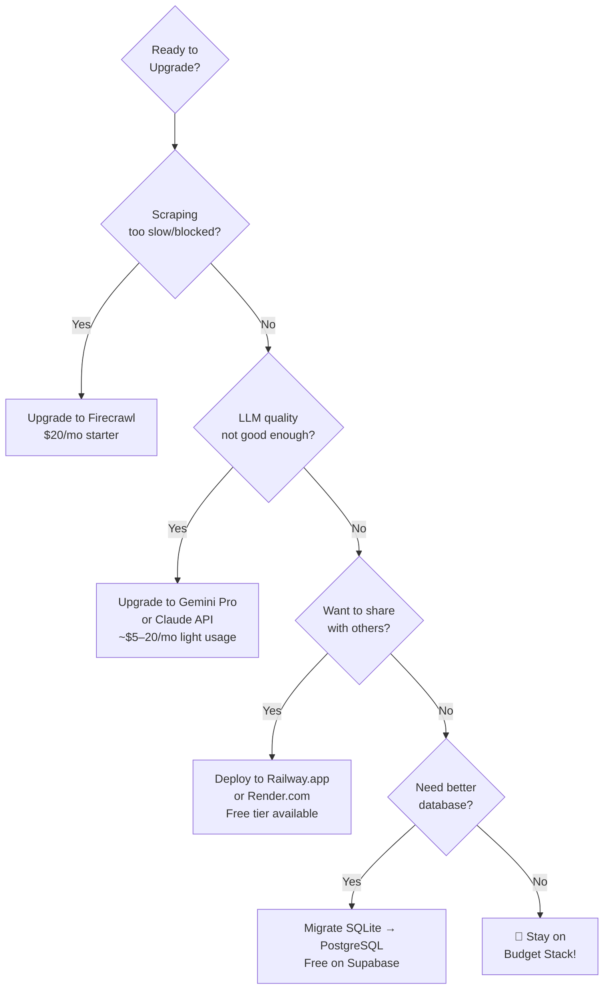

# JobHunt AI — Budget Learner's Edition 🎓

> **Philosophy:** Build the same thing, spend ₹0 on subscriptions. Every tool here is free, open-source, or has a generous free tier sufficient for personal experimentation. This plan is for one person learning, not a startup trying to scale.

---

## What You're Building (Simplified Scope)

A personal Python script/app that:
1. Scrapes job listings using free tools
2. Reads your resume and scores how well you match each job
3. Suggests resume edits and generates cover letters using a free local or API-backed LLM
4. Stores results in a lightweight local database
5. Shows everything in a simple web UI you run on your own laptop

No cloud bills. No credit card. Just your laptop and curiosity.

---

## 💸 Cost Comparison: Original vs. Budget Plan

| Component | Original Plan | Budget Plan | Monthly Saving |
|-----------|--------------|-------------|----------------|
| Web Scraper | Firecrawl ($200–400/mo) | Crawlee (free) + Playwright (free) | ~$300 |
| LLM / AI | Claude API ($150–300/mo) | Ollama + Llama 3 (free, local) | ~$225 |
| Hosting | AWS/GCP ($200–500/mo) | Your laptop / localhost | ~$350 |
| Database | Managed RDS ($100/mo) | SQLite (free) → PostgreSQL local (free) | ~$100 |
| Monitoring | Datadog ($50/mo) | Loguru + print() (free) | ~$50 |
| **Total** | **$800–1,450/mo** | **$0/mo** | **~$1,000/mo** |

---

## 1. Free Tool Stack

### 1.1 Scraping: Crawlee + Playwright (Both Free & Open Source)



**Why Crawlee?** It's open-source, runs locally, handles JavaScript-rendered pages via Playwright, and has no request limits. It's what Firecrawl is built on top of anyway.

**Python Alternative (Simpler to Start):**
```bash
pip install playwright beautifulsoup4 requests-html
playwright install chromium   # downloads a free headless browser
```

### 1.2 LLM / AI: Ollama (Free, Runs on Your Laptop)

Instead of paying for Claude API or OpenAI, run a local LLM:

```bash
# Install Ollama (free, open source)
curl -fsSL https://ollama.ai/install.sh | sh

# Pull a free model — Llama 3.2 is excellent for this use case
ollama pull llama3.2

# Or Mistral (lighter, faster on low RAM)
ollama pull mistral
```

**Model Recommendations by your laptop specs:**

| Your RAM | Recommended Model | Quality |
|----------|-------------------|---------|
| 8GB | Mistral 7B (4-bit) | Good |
| 16GB | Llama 3.2 8B | Very Good |
| 32GB | Llama 3.1 70B (4-bit) | Excellent |

**Free API Alternative (No local GPU needed):** Google Gemini API has a free tier of 1,500 requests/day — more than enough for experimenting.

```python
# Free option: Gemini API (15 RPM free tier)
import google.generativeai as genai
genai.configure(api_key="YOUR_FREE_API_KEY")  # from aistudio.google.com
```

### 1.3 Full Free Stack Summary



---

## 2. Simplified Architecture

### 2.1 Overall System (Local-First)



### 2.2 What You're NOT Building (Yet)

To keep scope realistic for a learner, skip these for v1:

- ❌ Mobile app
- ❌ User authentication (it's just you!)
- ❌ Cloud deployment
- ❌ Celery task queues
- ❌ Redis cache
- ❌ Auto-scaling
- ❌ Email/SMS notifications

You can add any of these later once the core works.

---

## 3. Project Structure

```
jobhunt-ai/
│
├── scraper/
│   ├── linkedin_scraper.py     # Playwright-based
│   ├── indeed_scraper.py
│   ├── naukri_scraper.py
│   └── normalizer.py           # Unify all job formats
│
├── parser/
│   ├── resume_parser.py        # LaTeX → structured data
│   └── jd_analyzer.py         # Job description → requirements
│
├── matching/
│   ├── ats_scorer.py           # TF-IDF keyword matching
│   ├── semantic_matcher.py     # SentenceTransformers (free)
│   └── confidence_score.py     # Weighted composite
│
├── generator/
│   ├── resume_optimizer.py     # Ollama-powered suggestions
│   └── cover_letter.py         # Ollama-powered generation
│
├── db/
│   └── database.py             # SQLite with SQLAlchemy
│
├── ui/
│   └── app.py                  # Streamlit dashboard
│
├── requirements.txt
├── .env.example                # API keys go here (gitignored)
└── README.md
```

---

## 4. Setup Guide (Step by Step)

### Step 1: Environment

```bash
# Clone / create your project
mkdir jobhunt-ai && cd jobhunt-ai
python -m venv venv
source venv/bin/activate       # Windows: venv\Scripts\activate

# Install everything — all free
pip install playwright beautifulsoup4 requests \
            spacy scikit-learn sentence-transformers \
            sqlalchemy streamlit python-dotenv \
            pylatexenc google-generativeai

# Download Playwright browser (free)
playwright install chromium

# Download spaCy model (free)
python -m spacy download en_core_web_sm   # 12MB, the small one is fine
```

### Step 2: Local LLM (Optional but Recommended)

```bash
# Install Ollama
curl -fsSL https://ollama.ai/install.sh | sh   # Mac/Linux
# Windows: download installer from ollama.ai

# Pull Mistral (4GB download, runs on 8GB RAM)
ollama pull mistral

# Test it
ollama run mistral "Write a one-line cover letter intro"
```

### Step 3: Free API Keys (If Skipping Local LLM)

Get a free Gemini API key at `aistudio.google.com` — no credit card needed, 1,500 free requests/day.

```bash
# .env file (never commit this to GitHub)
GEMINI_API_KEY=your_key_here
OLLAMA_BASE_URL=http://localhost:11434   # if using local
```

---

## 5. Core Implementation

### 5.1 Resume Parser (Free — Pure Python)

```python
# parser/resume_parser.py
import re
import spacy
from pylatexenc.latex2text import LatexNodes2Text

nlp = spacy.load("en_core_web_sm")

def parse_latex_resume(latex_path: str) -> dict:
    with open(latex_path, "r") as f:
        latex_content = f.read()

    # Convert LaTeX → plain text (free library)
    plain_text = LatexNodes2Text().latex_to_text(latex_content)

    # Extract skills using spaCy + regex
    doc = nlp(plain_text)

    # Simple section extraction by headers
    sections = extract_sections(plain_text)

    return {
        "raw_text": plain_text,
        "skills": extract_skills(sections.get("skills", "")),
        "experience": extract_experience(sections.get("experience", "")),
        "education": sections.get("education", ""),
        "summary": sections.get("summary", ""),
    }

def extract_skills(skills_text: str) -> list[str]:
    # Match common skill patterns
    skills = re.findall(
        r'\b(Python|JavaScript|React|AWS|Docker|SQL|Java|TypeScript|'
        r'Node\.js|FastAPI|Django|Kubernetes|Git|CI/CD|ML|NLP)\b',
        skills_text, re.IGNORECASE
    )
    return list(set(skills))
```

### 5.2 Scraper (Free — Playwright)

```python
# scraper/indeed_scraper.py
import asyncio
from playwright.async_api import async_playwright
from bs4 import BeautifulSoup

async def scrape_indeed(keywords: str, location: str, max_jobs: int = 20) -> list[dict]:
    jobs = []

    async with async_playwright() as p:
        browser = await p.chromium.launch(headless=True)
        page = await browser.new_page()

        url = f"https://www.indeed.com/jobs?q={keywords}&l={location}"
        await page.goto(url)
        await page.wait_for_timeout(2000)   # polite wait

        soup = BeautifulSoup(await page.content(), "html.parser")
        cards = soup.select(".job_seen_beacon")[:max_jobs]

        for card in cards:
            jobs.append({
                "title": card.select_one(".jobTitle")?.text.strip() or "",
                "company": card.select_one(".companyName")?.text.strip() or "",
                "location": card.select_one(".companyLocation")?.text.strip() or "",
                "snippet": card.select_one(".job-snippet")?.text.strip() or "",
                "source": "indeed"
            })

        await browser.close()

    # Be polite — add delay between requests
    await asyncio.sleep(3)
    return jobs
```

> ⚠️ **Note:** Scraping Indeed directly may violate their ToS. For learning purposes on localhost this is fine, but don't run it at scale. Consider using their [Publisher API](https://opensource.indeedeng.io/api-documentation/) (free with attribution) for a more ethical approach.

### 5.3 Confidence Score (Free — scikit-learn)

```python
# matching/confidence_score.py
from sklearn.feature_extraction.text import TfidfVectorizer
from sklearn.metrics.pairwise import cosine_similarity
from sentence_transformers import SentenceTransformer
from datetime import datetime

# Load free embedding model (downloads ~80MB once)
embedder = SentenceTransformer("all-MiniLM-L6-v2")  # Completely free

def calculate_confidence_score(resume: dict, job: dict) -> dict:
    ats   = ats_score(resume["raw_text"], job["description"])
    exp   = experience_score(resume["experience"], job.get("experience_years", 2))
    fresh = freshness_score(job.get("posted_date"))
    sem   = semantic_score(resume["raw_text"], job["description"])

    final = (
        0.35 * ats +
        0.25 * exp +
        0.20 * sem +      # replaces competition score (can't get that data easily)
        0.20 * fresh
    )

    return {
        "total": round(final, 1),
        "ats": round(ats, 1),
        "experience": round(exp, 1),
        "freshness": round(fresh, 1),
        "semantic": round(sem, 1),
    }

def ats_score(resume_text: str, jd_text: str) -> float:
    """TF-IDF keyword overlap — no API needed"""
    vectorizer = TfidfVectorizer(stop_words="english")
    matrix = vectorizer.fit_transform([resume_text, jd_text])
    similarity = cosine_similarity(matrix[0], matrix[1])[0][0]
    return similarity * 100

def semantic_score(resume_text: str, jd_text: str) -> float:
    """Sentence-level semantic similarity — runs locally, free"""
    r_emb = embedder.encode(resume_text[:512])   # truncate for speed
    j_emb = embedder.encode(jd_text[:512])
    sim = cosine_similarity([r_emb], [j_emb])[0][0]
    return float(sim * 100)

def freshness_score(posted_date) -> float:
    if not posted_date:
        return 50.0
    hours = (datetime.utcnow() - posted_date).total_seconds() / 3600
    if hours <= 24:   return 100.0
    elif hours <= 72: return 85.0
    elif hours <= 168: return 70.0
    elif hours <= 336: return 50.0
    else: return 30.0

def experience_score(resume_exp: list, required_years: int) -> float:
    candidate_years = len(resume_exp)   # rough proxy
    if candidate_years >= required_years: return 100.0
    return max(40.0, (candidate_years / max(required_years, 1)) * 100)
```

### 5.4 LLM Integration (Free — Ollama or Gemini)

```python
# generator/cover_letter.py
import os
import requests

def generate_cover_letter(resume: dict, job: dict) -> str:
    prompt = f"""
Write a concise, professional cover letter (3 paragraphs, ~200 words).

Candidate: {resume['raw_text'][:800]}
Job Title: {job['title']} at {job['company']}
Job Description: {job['description'][:600]}

Start directly with "Dear Hiring Manager," — no preamble.
"""
    return call_llm(prompt)

def call_llm(prompt: str) -> str:
    # Option A: Local Ollama (completely free, no internet)
    if os.getenv("USE_OLLAMA", "true") == "true":
        resp = requests.post(
            "http://localhost:11434/api/generate",
            json={"model": "mistral", "prompt": prompt, "stream": False}
        )
        return resp.json()["response"]

    # Option B: Gemini free tier (1500 req/day free)
    import google.generativeai as genai
    genai.configure(api_key=os.getenv("GEMINI_API_KEY"))
    model = genai.GenerativeModel("gemini-1.5-flash")   # free tier model
    return model.generate_content(prompt).text
```

---

## 6. Database (SQLite — Zero Cost, Zero Setup)



```python
# db/database.py
from sqlalchemy import create_engine, Column, Integer, Text, Float, DateTime
from sqlalchemy.orm import DeclarativeBase, Session
from datetime import datetime

engine = create_engine("sqlite:///jobhunt.db")   # creates a local file — free!

class Base(DeclarativeBase):
    pass

class Job(Base):
    __tablename__ = "jobs"
    id          = Column(Integer, primary_key=True)
    title       = Column(Text)
    company     = Column(Text)
    description = Column(Text)
    source      = Column(Text)
    url         = Column(Text)
    scraped_at  = Column(DateTime, default=datetime.utcnow)

class Match(Base):
    __tablename__ = "matches"
    id               = Column(Integer, primary_key=True)
    resume_id        = Column(Integer)
    job_id           = Column(Integer)
    confidence_score = Column(Float)
    ats_score        = Column(Float)
    semantic_score   = Column(Float)
    status           = Column(Text, default="new")

Base.metadata.create_all(engine)
```

---

## 7. UI (Streamlit — Free, Runs Locally)



```python
# ui/app.py
import streamlit as st
import pandas as pd
from db.database import Session, Job, Match
from parser.resume_parser import parse_latex_resume
from matching.confidence_score import calculate_confidence_score
from generator.cover_letter import generate_cover_letter

st.set_page_config(page_title="JobHunt AI — Local Edition", layout="wide")
st.title("🎯 JobHunt AI — Budget Edition")

tab1, tab2, tab3, tab4 = st.tabs(
    ["📄 Resume", "🔍 Scrape Jobs", "📊 Matches", "✉️ Generate Docs"]
)

with tab1:
    st.header("Upload Your Resume")
    uploaded = st.file_uploader("Upload LaTeX resume (.tex)", type=["tex"])
    if uploaded:
        with open("resume.tex", "wb") as f:
            f.write(uploaded.read())
        resume = parse_latex_resume("resume.tex")
        st.success("✅ Resume parsed!")
        st.json({"skills": resume["skills"], "experience_count": len(resume["experience"])})
        st.session_state["resume"] = resume

with tab2:
    st.header("Scrape Job Listings")
    keywords = st.text_input("Job keywords", "Python Developer")
    location = st.text_input("Location", "Remote")
    max_jobs = st.slider("Max jobs to scrape", 5, 50, 20)
    if st.button("🚀 Start Scraping"):
        with st.spinner("Scraping... (be patient, we're being polite)"):
            # call your scraper here
            st.success(f"Found jobs — check the Matches tab!")

with tab3:
    st.header("Job Matches")
    if "resume" in st.session_state:
        with Session(engine) as session:
            jobs = session.query(Job).order_by(Job.scraped_at.desc()).limit(50).all()
        if jobs:
            scores = [calculate_confidence_score(st.session_state["resume"], j.__dict__) for j in jobs]
            df = pd.DataFrame([{
                "Company": j.company, "Title": j.title,
                "Score": s["total"], "ATS": s["ats"], "Semantic": s["semantic"]
            } for j, s in zip(jobs, scores)]).sort_values("Score", ascending=False)
            st.dataframe(df, use_container_width=True)

with tab4:
    st.header("Generate Cover Letter")
    job_idx = st.number_input("Enter job index from matches table", min_value=0)
    if st.button("✨ Generate"):
        with st.spinner("Running local LLM..."):
            letter = generate_cover_letter(st.session_state["resume"], {})
            st.text_area("Cover Letter", letter, height=300)
            st.download_button("⬇️ Download", letter, "cover_letter.txt")
```

Run it with:
```bash
streamlit run ui/app.py
```

---

## 8. Learning Roadmap

### 8.1 Phased Timeline for a Solo Learner



### 8.2 What You'll Learn Along the Way



---

## 9. Free Resources & Alternatives Cheat Sheet

### 9.1 Every Paid Tool Replaced



### 9.2 Free API Tiers Worth Knowing

| Service | Free Tier | Good For |
|---------|-----------|----------|
| **Google Gemini API** | 1,500 req/day, 1M tokens/min | Cover letters, JD analysis |
| **Groq API** | 14,400 req/day on Llama 3 | Fast inference, free |
| **Hugging Face Inference** | Rate-limited free calls | Embedding models |
| **Together AI** | $25 free credits | Mixtral, Llama models |
| **Cohere** | 1,000 free API calls/month | Embeddings |

### 9.3 Recommended Learning Order

1. **Week 1** — Python basics + `pip install playwright` + scrape one job page manually
2. **Week 2** — Parse your own resume into a Python dict
3. **Week 3** — TF-IDF keyword matching (scikit-learn tutorial)
4. **Week 4** — Install Ollama, prompt it to write a cover letter
5. **Week 5** — SQLite + store 20 jobs
6. **Week 6** — Streamlit dashboard showing your matches
7. **Week 7+** — Polish, add features, experiment

---

## 10. Ethical Scraping on a Budget

Since you're not paying for a managed scraping service, you need to be extra responsible:



**Best Free & Legal Data Sources for Learning:**
- **Indeed Publisher API** — free with attribution, official
- **LinkedIn Job Search** — limited free scraping for personal use
- **Naukri.com** — public job pages, scrape slowly
- **GitHub Jobs API** — for tech roles (archived but good for practice)
- **RemoteOK API** — completely free, no auth needed
- **Hacker News "Who's Hiring"** — free monthly thread, easy to parse

---

## 11. When to Upgrade (And What to Upgrade First)

Once you've built the learning version and want more:



**Upgrade Priority Order:**
1. **Supabase** (free PostgreSQL in cloud) — when SQLite file gets big
2. **Gemini Pro or Claude API** — when Ollama's output quality isn't enough
3. **Railway.app** (free $5/mo credit) — when you want to access it from anywhere
4. **Firecrawl** — only if you're scraping >500 jobs/day

---

## 12. Project Cost Summary

### One-Time Setup
| Item | Cost |
|------|------|
| Python, Node.js, Git | Free |
| Ollama + Llama 3 model | Free (uses ~4–8GB disk) |
| Playwright Chromium | Free |
| All pip packages | Free |
| **Total Setup Cost** | **₹0 / $0** |

### Monthly Running Cost
| Item | Cost |
|------|------|
| Electricity (laptop runs ~6h/day more) | ~₹50–100 |
| Internet bandwidth (model downloads, scraping) | Included in your plan |
| Gemini API (if using, free tier) | Free |
| GitHub (code hosting) | Free |
| **Total Monthly Cost** | **₹50–100 (~$1)** |

---

## 13. Appendix: Minimal requirements.txt

```
# Web scraping
playwright==1.44.0
beautifulsoup4==4.12.3
requests==2.32.3

# Resume parsing
pylatexenc==2.10
spacy==3.7.4

# ML & Embeddings (all free, all local)
scikit-learn==1.4.2
sentence-transformers==3.0.1
numpy==1.26.4

# Database
sqlalchemy==2.0.30

# UI
streamlit==1.35.0
pandas==2.2.2

# LLM (optional if using Ollama)
google-generativeai==0.7.2   # Gemini free tier

# Utilities
python-dotenv==1.0.1
loguru==0.7.2
rich==13.7.1                  # pretty terminal output
```

Install with: `pip install -r requirements.txt`

---

## Conclusion

You don't need to spend a rupee to build something genuinely impressive. The budget stack — Playwright + SentenceTransformers + Ollama + SQLite + Streamlit — covers 90% of what the paid version does. The main thing you're trading is convenience and scale, neither of which matters when you're learning.

**Start small:** get the resume parser working first. Then the scraper. Then plug them together. The confidence score and cover letter generator are the fun parts — save them for when the boring plumbing works.

The best version of this project is the one you actually finish. Keep it simple, keep it free.

---

*Budget Edition v1.0*
*For learners, by design*
*Last Updated: 2026-05-03*
